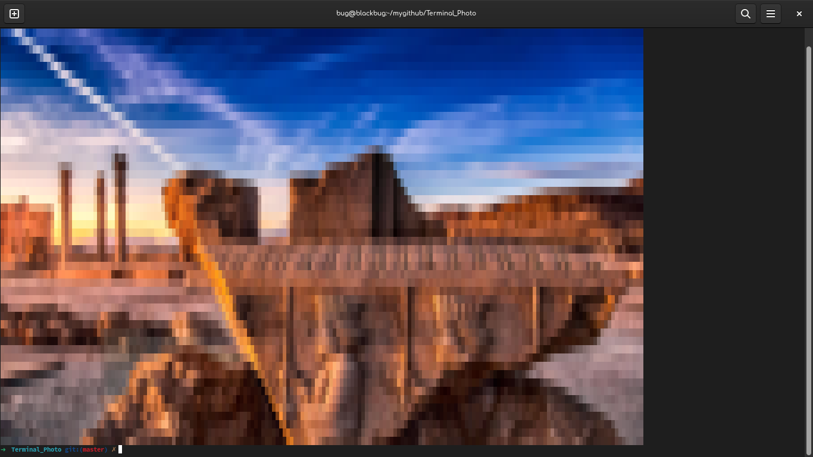
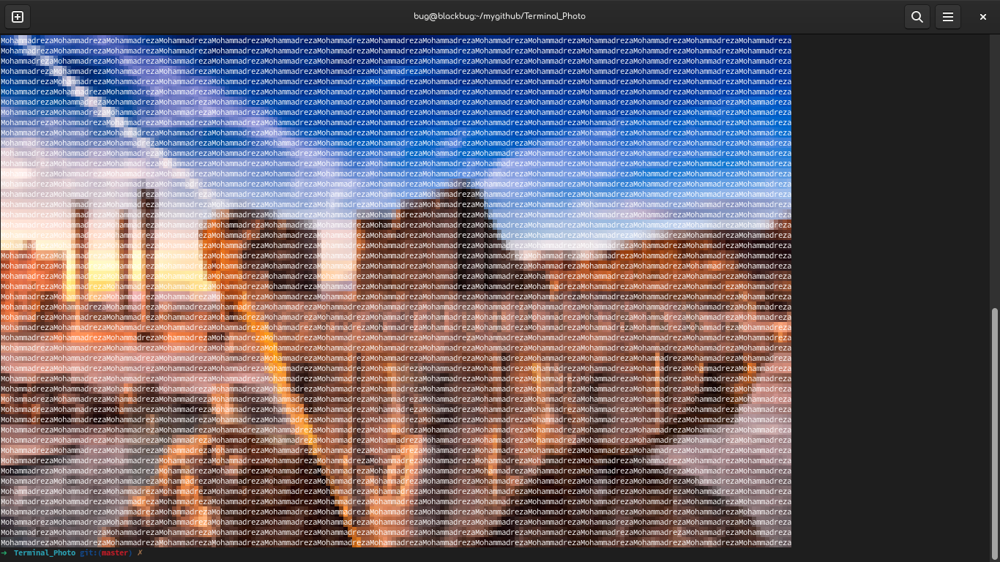
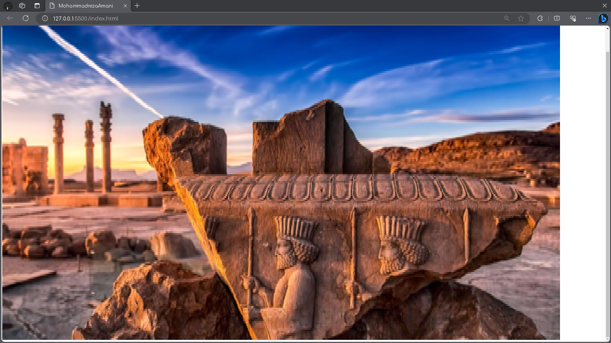
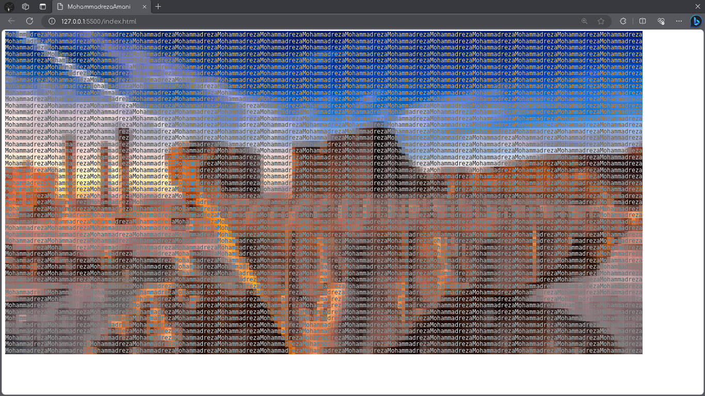

# Terminal_Photo
 
<p align="center">
    <a>
        
    </a>
    <br>
    <b>A tool that can be used to show photos in Terminal or Browser </b>
    <br>
</p>

<br>


### Usage
1. Convert photo to terminal readable colorful chars.
2. Convert photo to browser readable (HTML) colorful chars.
3. See examples to find out what is this. :')


### Example

write one of this following code in see the results.


``` python
terminal_photo.photo import Photo

obj = Photo(
    path="./assets/Example.jpg",  # path of your image
    text=" ",  # text that you want to show (if there is nothing use ' ')
    size=(50, 180),  # size of your image
    front=False,  # show color as char color or as background color
    mode="run",  # mode? run: show in print, html = save as html file, bash= save as bash file
)

obj.start()

```

> output: 


``` python
terminal_photo.photo import Photo

obj = Photo(
    path="./assets/Example.jpg",  # path of your image
    text="Mohammadreza",  # text that you want to show (if there is nothing use ' ')
    size=(50, 180),  # size of your image
    front=True,  # show color as char color or as background color
    mode="run",  # mode? run: show in print, html = save as html file, bash= save as bash file
)

obj.start()

```

> output: 

``` python
terminal_photo.photo import Photo

obj = Photo(
    path="./assets/Example.jpg",  # path of your image
    text=" ",  # text that you want to show (if there is nothing use ' ')
    size=(50, 180),  # size of your image
    front=False,  # show color as char color or as background color
    mode="html",  # mode? run: show in print, html = save as html file, bash= save as bash file
)

obj.start('index.html') # enter the name and path of output while using html or bash mode

```

> output: 

``` python
terminal_photo.photo import Photo

obj = Photo(
    path="./assets/Example.jpg",  # path of your image
    text="Mohammadreza",  # text that you want to show (if there is nothing use ' ')
    size=(50, 180),  # size of your image
    front=False,  # show color as char color or as background color
    mode="html",  # mode? run: show in print, html = save as html file, bash= save as bash file
)

obj.start('index.html') # enter the name and path of output while using html or bash mode

```

> output: 